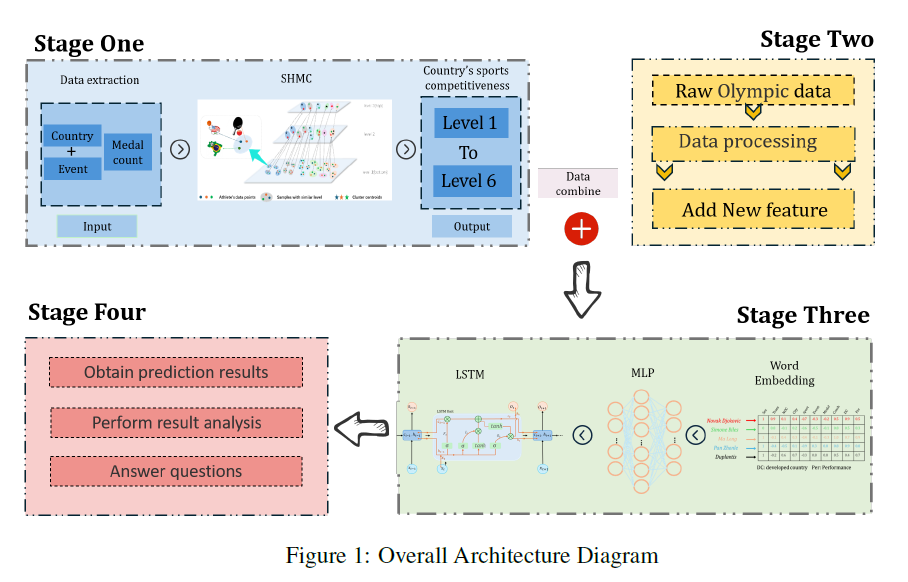
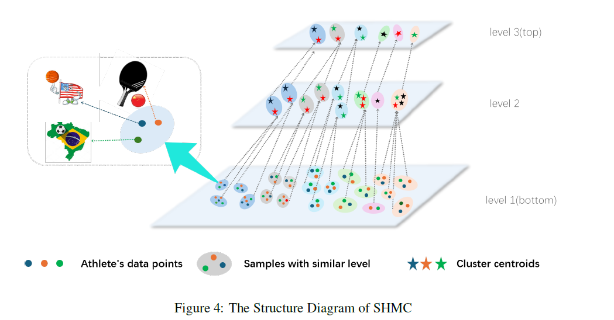

# 2025-Mathematical-Contest-In-Modeling
2025美赛C题
## MM-LSTM: A Momentum LSTM Model for Tennis Match Prediction and Analysis

The research concludes with a memorandum summarizing findings, demonstrating the role of momentum in matches, and providing detailed advice for coaches and players on handling momentum.
